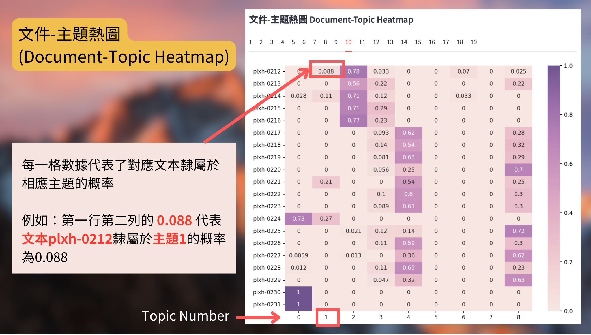
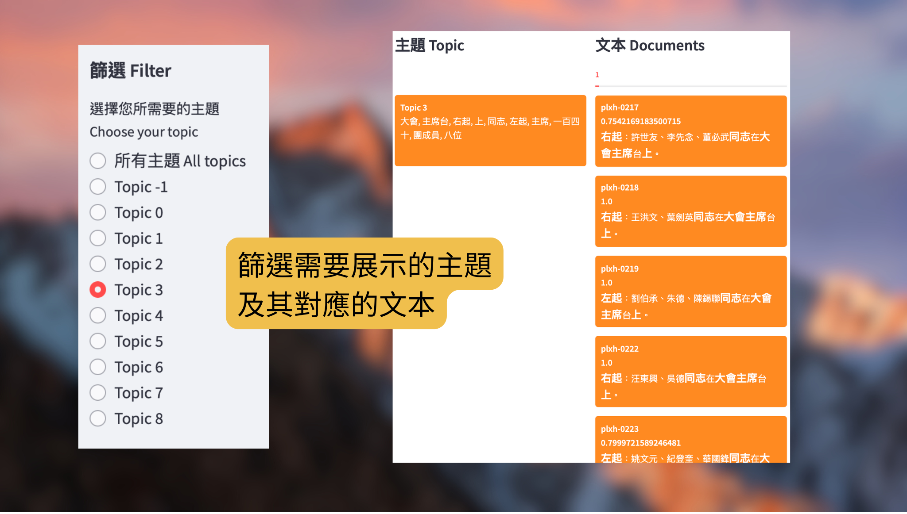

# 使用手冊（中文文本主題分析工具）Manual Guide for using our Chinese Topic Modeling Tool

## 介紹 Introduction

**主題模型/主題建模/主題分析 (Topic Modeling)** 是一種自然語言處理 (NLP) 技術，透過分析文本中的文字的出現概率和分佈，使研究人員能夠從語料庫中提取有意義的主題，進而進行主題聚類或文本分類，幫助我們理解文本的核心內容，並將相似的文本歸類到同一主題下。

過去，LDA (Latent Dirichlet Allocation) 是主題模型的主流方法，它基於統計學原理，通過詞頻來推斷主題，雖然簡單易用，但在處理複雜語義和上下文時表現有限。而我們這個工具採用了開源的 [BERTopic 模型](https://arxiv.org/abs/2203.05794)，透過預先訓練的 BERT 模型來對文本中的語義進行聚類，希望能夠更精準地捕捉文本的深層含義。

另外，根據中文特有的語言結構和語料庫特性，我們選用了以下專門針對中文訓練的工具，以提高模型的準確性和可解釋性:
- 文本處理工具 — [Jieba](https://github.com/fxsjy/jieba)
- [停用詞表](https://github.com/YueYongDev/stopwords)，包括中文停用詞表, 哈工大停用詞表, 百度停用詞表, 及四川大學機器智能實驗室停用詞庫
- 嵌入模型 - [中文BERT模型](https://huggingface.co/uer/sbert-base-chinese-nli) 
 

## 下載使用 Download and Use
請前往以下網址，依照指示下載並使用：https://github.com/hkust-lib-ds/P003-PUBLIC_English-and-Chinese-Topic-Modeling-Tool

## 入門指南 Getting Started

### 1 介面概覽

主介面 (Main Page) 支援以下功能： 

* 上載文件 
* 探索主題 
* 儲存訓練模型或數據 
* 應用訓練模型來預測新數據
* 追蹤主題隨時間的變化 

側邊欄 (Sidebar) 支援以下功能： 

* 參數設定 
* 主題展示 
* 上載模型 

### 2 流程示例

若你是初次使用我們這個工具，可以參考以下使用流程展開探索：

> _下方示例中顯示的數據來自我們香港科技大學圖書館的特藏 - [Paul T. K. Lin’s Hsinhua Photo Collection](https://lbezone.hkust.edu.hk/rse/paul-tk-lin-hsinhua-photo-collection)._

#### 2.1 上載文件

### 2 主介面功能詳解
<a name="Upload-documents">
 
#### 2.1 上載文件 Upload documents

</a>
2.1.1 點擊「Browse files」，可上傳一個或以上的 txt/csv 文檔。

 * 可同時上傳不同格式的檔案。 
 * 文件格式請參考2.1.2及圖例
 

2.1.2 選擇合適的時間格式：

我們提供4個時間格式供選擇。

_請注意，如果您希望查看到不同主題在各個時間段的分佈情況的分析結果（例如，哪些主題在哪些時期的文檔數量更多及其趨勢），請選擇時間格式2-4，你可以在[追蹤主題隨時間的變化](#TopicOverTime)查看如何解讀這個功能的圖表。_

 1.  `不追蹤`：不追蹤主題隨時間的變化，接受上傅 txt 或 csv 文檔
 2. `年月日`：只接受上傅 csv 文件，欄名順序依次為：文檔編號 (`id`) - 文檔內容 (`description`) - 年 (`year`) - 月 (`month`) - 日 (`day`)
 3. `時間戳`：只接受上傅 csv 文件，欄名順序依次為：文檔編號 (`id`) - 文檔內容 (`description`) - 時間戳 (`timestamp`)
 4. `自定義`：只接受上傅 csv 文件，欄名順序依次為：文檔編號 (`id`) - 文檔內容 (`description`) - 自定義時間格式 (`date`) 

**有關如何`自定義`時間格式:**
| 資料     | `自定義`接受的時間格式               |
|------------|----------------------|
| 年 Year     | `2024`                |
| 月 Month    | `9` `09` `Sep` `September`   |
| 日 Day    | `6` `06`   |
| 符號 Symbols | `-` `/` `.` `,`  `st` `nd` `rd` `th` |

- 月份的縮寫必須使用前三個字母
- 如果缺少月份和/或日期的信息，將設置為 `00`；如果缺少年份，將設置為 `0000`
- 如果上述策略無法滿足您的需求，請重新格式化您的日期
- 任何順序都是允許的，格式將根據元素的位置進行檢測
- 在「輸入您的時間格式」下方的空格，請以2024年9月6日為例，輸入您的時間格式，程式將根據您輸入的元素位置進行檢測，例如請輸入 : `2024-09-06` / `2024 Sep 6` / `6th Septmber 2024`

   
2.1.3 點擊「確認上載文件」

<a name="Visualization">

#### 2.2 探索主題

</a>

為了幫助使用者更直觀地理解文本的主題分佈，識別出重要主題以及它們之間的關聯，並清楚呈現文件與主題的關係，我們在這裡加入了多種視覺化工具。透過這些工具，使用者可以輕鬆探索主題之間的相似性和距離，讓分析結果一目了然。 

使用者可以根據需要切換不同的可視化工具。

在每一幅可視化圖像的下方，均設有下載按鈕，使用者可以儲存可視化結果圖像作進一步分析與共享。 

##### 2.2.1 長條圖 (Barchart)
用於展示各主題的相對重要性或頻率。通過直觀的長條高度比較，使用者可以快速了解哪些主題在文本資料中較為突出。

##### 2.2.2 主題間距圖 (Intertopic Distance Map)
顯示不同主題之間的相似性或距離。通常使用降維技術（如 t-SNE 或 UMAP）來視覺化主題之間的關係，幫助使用者理解主題分佈及其相互關係。

##### 2.2.3 詞雲庫 (WordCloud)
以視覺化的方式展示主題中最重要的詞彙，詞的大小代表其在主題中的重要性。這種視覺化能迅速提供主題的核心概念。

##### 2.2.4 相似矩陣 (Similarity Matrix)
用於量化和展示主題之間的相似性。矩陣中的每個元素表示兩個主題之間的相似度，通常用於分析主題之間的重疊或關聯性。

##### 2.2.5 文件-主題關係圖 (Document-Topic 2D)
顯示每個文件與各主題的關聯程度。這種視覺化幫助使用者理解哪些文件主要涉及哪些主題，以及主題在文件中的分佈情況。

##### 2.2.6 文件-主題數據映射 (Document-Topic Datamap)
以更詳細的方式展示每個文件所屬的主題分佈，通常使用熱圖或其他可視化方法來直觀地展示主題與文件的對應關係。

##### 2.2.7 文件-主題熱圖 (Document-Topic Heatmap)
使用色彩強度來表示文件與主題之間的關聯程度，色彩越深表示關聯性越強。這種視覺化可以快速識別文件中涉及的重要主題。

##### 2.2.8 主題與文件的對照展示
將主題與文件以兩列的形式對照展示：
* 隸屬於同一主題的文本會以同一主題顏色為底色，方便瀏覽。數字表示該主題出現的概率。
* 文本分成若干批次，可以在上方選擇欄滾動點選不同的文件範圍
* 文本內的主題代表詞會以粗體及放大顯示 

<a name="Export">
 
#### 2.3 儲存訓練模型或數據

</a>
訓練完成後，使用者可以下載訓練模型或數據。 

<a name="Predict">

#### 2.4 應用訓練模型來預測新數據

</a>
你還可以使用訓練成功的模型，預測新上傅的文本所對應的主題，並儲存預測數據。如果數據量龐大，你先訓練一小部分的數據，然後儲存該模型，接著在側邊欄清除模型後，重新上傳模型，以跳過可視化階段，更快為所有數據完成主題預測工作。 

<a name="TopicOverTime">
 
#### 2.5 追蹤主題隨時間的變化

</a>

此功能可以幫助使用者查看到不同主題在各個時間段的分佈情況的分析結果（例如，哪些主題在哪些時期的文檔數量更多及其趨勢）。

如果你在上載文件時選擇了「追蹤主題隨時間變化」，主介面最下方會顯示這一板塊 - 每個主題的時間長條圖。 

但是，如果你在上載文件時沒有選擇「追蹤主題隨時間變化 — 時間戳」，選擇的時間格式不是「時間戳」，你需要必須先生成時間戳，才能點擊開始「訓練隨時間變化的主題模型」。 你可以自行選擇生成時間戳的個數，我們將通過 k-means 模型，組合你的文本所帶有的時間信息，給予你生成時間戳的建議。 

時間戳生成後，點擊「訓練隨時間變化的主題模型」，你可以獲得主題隨時間變化的折線圖。你還可以點擊「下載隨時間變化的主題模型」，儲存相關數據。 

### 3 側邊欄功能詳解
在側邊欄上方，可以連接至使用手冊及GitHub的頁面。 

<a name="Train-model">
 
#### 3.1 參數設定

</a>

1. `主題需要包含的文檔數量最小值`: 你可以設定一個主題最少需要包含多少篇文章。如果一個主題的文章數量少於這個值，系統可能會把這個主題合併到其他主題或直接忽略。此處最小值是1，最大值是30。建議不要設定太大的數字。 

2. `每個主題的代表詞匯數量`: 你可以設定每個主題包含多少個關鍵詞。此處最小值為1，最大值為20。

3. `呈現的最大主題數量`: 你可以設定最多生成多少個主題，此處最小值為1，最大值為20。 

4. 設定停用詞表 (Stopwords)
    * 默認停用詞表：`百度停用詞表`
    * 可選擇切換其他停用詞表或上載自定義停用詞表
    * 可在當前停用詞表基礎上，增加/減少停用詞
    * 若你有多於1個停用詞需要修改時，建議你下載停用詞表至個人電腦自行修改。完成修改後再另行上傳，以保證訓練效率。

5. 點擊「探索主題 Discover topics」，訓練模型以在右方主介面查看文檔與主題的分佈結果。

<a name="Topic-display">
 
#### 3.2 主題展示

</a>
使用者可以根據個人需要，在側邊欄—主題展示板塊，選擇你所需要的主題，或自行命名主題的名稱。 

##### 3.2.1 篩選主題 (Filter topic)

##### 3.2.2 命名主題 (Rename topic)

<a name="Import">
 
#### 3.3 上載模型

</a>
除了上載文件訓練模型以外，你還可以上載先前儲存的模型。

但請注意，由於 BERTopic 模型不會儲存文本內容，所以每次訓練模型後，請先儲存訓練文本。此外，以下相關的展示功能無法使用:
- 文件-主題關係的三個可視化工具
- 文件-主題的對照展示

以下功能則可以正常使用:
- 如主題相關的可視化工具
- 預測新文本的主題等

如要展示文本內容，請先上載你先前用於探索主題的文本，這樣才能使用相關功能。

