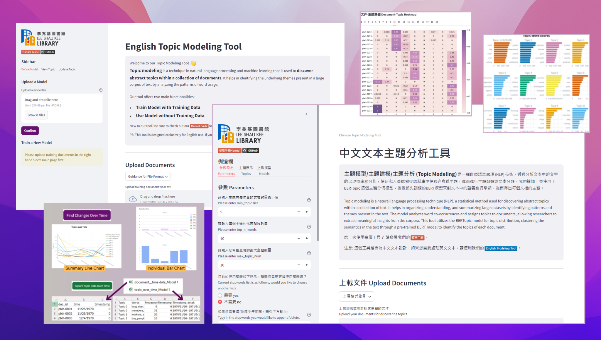

_HKUST Library - DS CoLab Project - P003_
# English and Chinese Topic Modeling Tool

**Project Introduction:**  https://library.hkust.edu.hk/ds/project/p003/  
**Timeframe:** 2024/25 Fall semester (Sep-Dec 2024)

## Preview



## Manual

+ [使用手冊 - 中文版](https://github.com/hkust-lib-ds/P003-PUBLIC_English-and-Chinese-Topic-Modeling-Tool/blob/main/CHI/README.md)
+ [Manual Guide - English version](https://github.com/hkust-lib-ds/P003-PUBLIC_English-and-Chinese-Topic-Modeling-Tool/blob/main/ENG/README.md)

## Run our tool on your computer locally

1. **Ensure [python (best compatible version v3.12)](https://www.python.org/downloads/) and [pip](https://pip.pypa.io/en/stable/installation/) are installed in your computer.**

> [!TIP]
> If you encounter difficulties in installing python and pip, please see slide 7-14 [here](https://digitalhumanities.hkust.edu.hk/tutorials/dive-deeper-into-python-and-streamlit-to-create-website-an-advanced-guide-with-demo-code-and-slides/#slides).

2. **Download our source code.**

   ```
   git clone https://github.com/hkust-lib-ds/P003-PUBLIC_English-and-Chinese-Topic-Modeling-Tool.git
   ```

3. **Change to the appropriate folder location.**
   
   For processing Chinese text:
   ```
   cd P003-PUBLIC_English-and-Chinese-Topic-Modeling-Tool/CHI
   ```

   For processing English text:
   ```
   cd P003-PUBLIC_English-and-Chinese-Topic-Modeling-Tool/ENG
   ```

   
4. **Install the required dependencies using the following command.**

    ```
    pip3 install -r requirements.txt
    ```

    OR

    ```
    python3.12 -m pip install -r requirements.txt
    ```

5. **Run our tool using the following command.**

    ```
    streamlit run main.py
    ```

    OR

    ```
    python3.12 -m streamlit run main.py
    ```

> [!TIP]
> If you encounter difficulties in running the app, please read [this articles](https://digitalhumanities.hkust.edu.hk/tutorials/learn-python-from-zero-for-absolute-beginner-3-create-website/#view-locally) for reference.


## Project Team

| Developers          | Details                                    |
| :------------------ | :----------------------------------------- |
| YIP Sau Lai, Sherry | Year 4, BSc in Data Science and Technology |
| WANG Yuning, Yolanda   | Year 3, BEng in Computer Science |

| Advisers    | Details                                |
| :---------- | :------------------------------------- |
| Holly CHAN  | Assistant Manager (Digital Humanities) |
| Amanda MAK  | Officer (Systems & Digital Services)   |
| Winny MAK   | Officer (Research Support)             |
